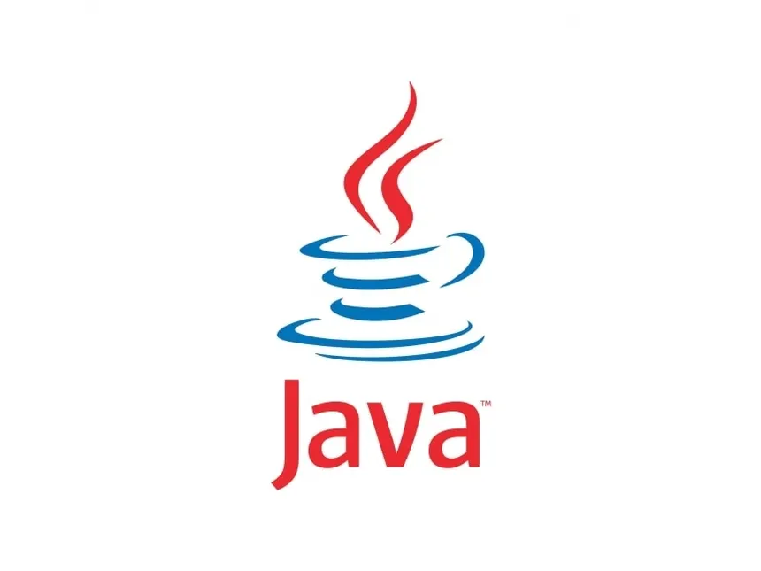
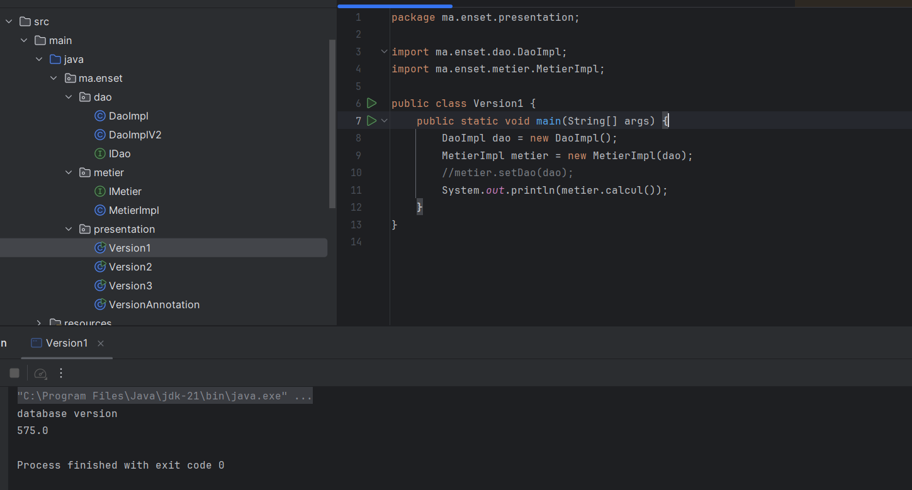
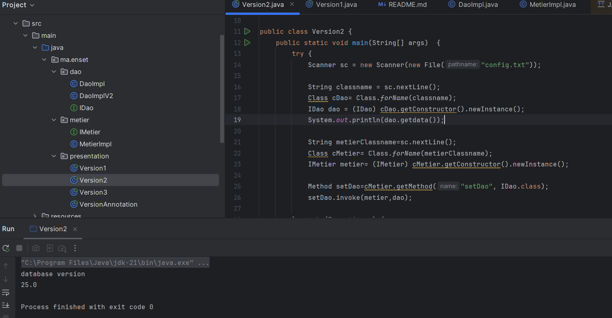
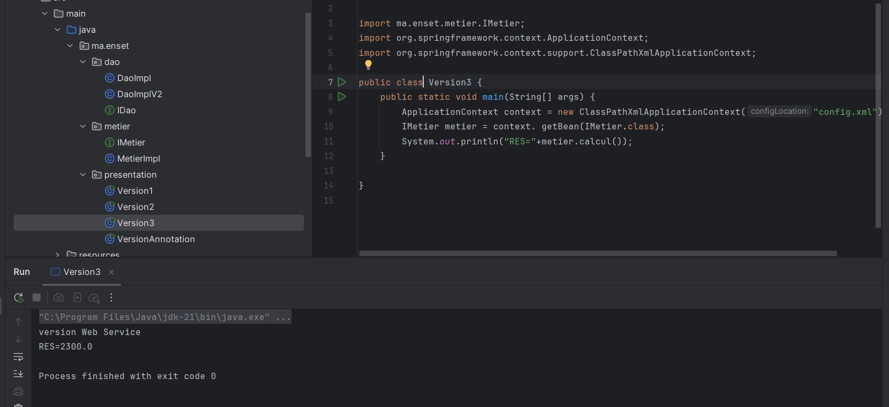
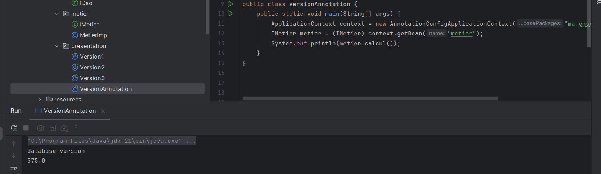

# 🔄 Inversion de Contrôle & Injection de Dépendances en Java


## 🧠 Présentation du projet
Ce projet met en œuvre les principes de **l'inversion de contrôle (IoC)** et de **l'inction de dépendances (DI)** en Java. Il explore plusieurs approches, allant de l'instanciation manuelle à l'utilisation de **Spring IoC**, et va jusqu'à la création d'un **mini-framework d'injection personnalisé**, inspiré de Spring.

## 🎯 Objectifs pédagogiques

- Comprendre les concepts d'IoC et de DI
- Implémenter un couplage faible entre les composants métier et les dépendances
- Appliquer différentes méthodes d'injection :
  - Instanciation statique
  - Instanciation dynamique (via réflexion)
  - Utilisation de Spring (XML et annotations)
  - Mini-framework personnalisé
- Développer les bases d'un framework de type Spring simplifié

---

## 🧱 Architecture du projet

```
src
├── main
│   ├── java
│   │   ├── ma
│   │   │   ├── enset
│   │   │   │   ├── dao
│   │   │   │   │   ├── IDao.java
│   │   │   │   │   ├── DaoImpl.java
│   │   │   │   │   └── DaoImplV2.java
│   │   │   │   ├── metier
│   │   │   │   │   ├── IMetier.java
│   │   │   │   │   └── MetierImpl.java
│   │   │   │   └── présentation
│   │   │   │       ├── Version1.java
│   │   │   │       ├── Version2.java
│   │   │   │       ├── Version3.java
│   │   │   │       └── VersionAnnotation.java
│   │   └── resources
│   │   │   └── config.xml
```

---

## ✅ Prérequis

- Java JDK 8 ou supérieur
- IntelliJ IDEA ou tout autre IDE Java
- Maven
- Git

---

## 🚀 Lancer le projet

1. **Cloner le dépôt** :

   ```bash
   git clone https://github.com/mreckah/Inversion_Control.git
   cd Inversion_Control
   ```

2. **Ouvrir le projet avec IntelliJ IDEA** :
   - `File > Open > Sélectionnez le dossier du projet`
   - Maven s'exécutera automatiquement pour télécharger les dépendances
   - Exécutez une classe du package `ma.enset.presentation` selon la version à tester

---

## 🧪 Test des méthodes d'injection

| Classe Java         | Méthode d'injection                 |
| ------------------- | ----------------------------------- |
| `Version1`          | Instanciation statique              |
| `Version2`          | Instanciation dynamique (réflexion) |
| `VersionAnnotation` | Spring avec annotations             |
| `Version3`          | Mini-framework personnalisé         |

---

## 🖼 Diagrammes

### 🧩 Diagramme de classes


### 📸 Exemple de sortie console
Version1	Injection statique


Version2	Injection dynamique
[text](README.md) 

Version3	Injection via Spring XML


VersionAnnotation	Injection via annotations Spring	
[text](README.md) 

---

## ⚙️ Mini-framework IoC

Un framework léger d'injection de dépendances a été conçu, avec les fonctionnalités suivantes :

- Injection via **fichier XML** (en utilisant JAX Binding)
- Injection via **annotations personnalisées**
- Prise en charge de l'injection par **constructeur**, **setter**, et **attribut**

> 🛠️ Cette partie est encore en développement dans le dépôt

---

## 👨‍💻 Réalisé par

- **Auteur :** Oussama NABBAR
- **Encadrant :** Mohamed ELYOUSSFI
- **Contexte :** Projet pédagogique - Cours Java JEE
